# Workshop - Crea tu Chatbot en Telegram con Dialogflow ES
Este repositorio tiene las instrucciones y los recursos para creaar desde cero un chatbot en Telegram usando Dialogflow ES.

## Requerimientos
- Una cuenta activa de Google Cloud 
- Se deben seguir los pasos de **Configuración y limpieza de Dialogflow ES** descritos [acá](https://cloud.google.com/dialogflow/es/docs/quick/setup?hl=es-419).
- Para el uso de la herramienta de automatización Bulk Intent Generator se requiere Python 3 instalado, aunque no es extrictamente necesario para el workshop.
- Se recomienda tener una cuenta de Telegram para crear el bot y probar chatbot. Igualmente se recomienda tener la aplicación de Telegram instalada en un dispositivo móvil u ordenador.

## Dialaogflow ES
Dialogflow es una plataforma con comprensión del lenguaje natural que te facilita el diseño de una interfaz de usuario de conversación y su integración a tu aplicación para dispositivos móviles, aplicación web, dispositivo, bot, sistema de respuesta de voz interactiva y más. Con Dialogflow, puedes proporcionar nuevas y atractivas formas para que los usuarios interactúen con tu producto.

En el workshop se seguirá los pasos necesarios para crear un Agente en Dialogflow ES e integrarlo con Telegram, descritos en las Guías de inicio rápido del portal de documentación de Dialogflow:
- [Guía de inicio rápido: Crea un agente de Dialogflow ES](https://cloud.google.com/dialogflow/es/docs/quick/build-agent?hl=es-419)
- [Integración de Dialogflow ES con Telegram](https://cloud.google.com/dialogflow/es/docs/integrations/telegram?hl=es-419)

### Crea un Agente de Dialogflow ES
Los pasos para crear un Agente nuevo en Dialogflow son los siguientes:
1. Ve a la [Consola de Dialogflow ES](https://dialogflow.cloud.google.com/).
2. Si se te solicita, inicia sesión en la consola de Dialogflow.
3. Haz clic en **Create agent**, en el menú de la barra lateral izquierda. (Si ya tienes otros agentes, haz clic en el nombre del agente, desplázate hacia la parte inferior y haz clic en **Create new agent**)
4. Ingresa el nombre del agente, y el idioma y la zona horaria predeterminados.
5. Si ya creaste un proyecto, ingrésalo. Si quieres que la consola de Dialogflow cree el proyecto, selecciona **Create a new Google project**.
6. Haz clic en el botón **Create** (Crear).

### Intents
Para ver los Intents del Agente, accede a la lista de intents del agente mediante los siguientes pasos:
1. Ve a la [Consola de Dialogflow ES](https://dialogflow.cloud.google.com/).
2. Selecciona el agente que acabas de crear.
3. Haz clic en **Intents**, en el menú de la barra lateral izquierda.
En el centro de la consola, se muestra la lista de intents del agente.

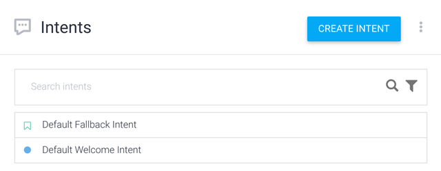

#### Probar los Intents
Dialogflow crea dos intents por defecto, El intent de Bienvenida Welcome y el intent Fallback.
Para probar el agente, haz lo siguiente:
- Haz clic en el campo **Try it now** (Probar ahora).
- Escribe `¿Cuál es tu nombre?`.
- Presiona Intro.

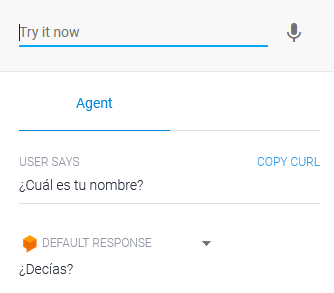

La respuesta del agente aparece en la sección **Default response** (Respuesta predeterminada). Dado que tu entrada no coincidió con ningún intent, el intent de resguardo predeterminado coincidió y recibiste una de las respuestas predeterminadas.

#### Crear un intent nuevo
Los pasos de esta sección crean un intent que puede responder la pregunta **“What is your name?”** (¿Cómo te llamas?).
1. Haz clic en el botón para agregar intents **[+]** junto a Intents en el menú de la barra lateral izquierda.
2. Ingresa `get-agent-name` en el campo **Intent name**.
3. En la sección **Training Phrases** (Frases de entrenamiento), haz clic en **Add training phrases**.
4. Ingresa las siguientes frases de entrenamiento y presiona Intro después de cada entrada:
    - `¿Cuál es tu nombre?`
    - `¿Tienes un nombre?`
    - `Dime tu nombre`

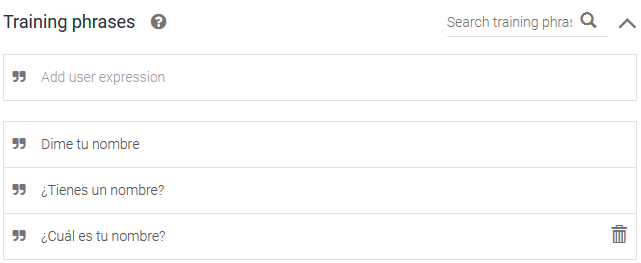

5. Dentro de `Responses` (Respuestas), ingresa lo siguiente en la sección `Text Response` (Respuesta de texto):
    - `Mi nombre es Dialogflow!`

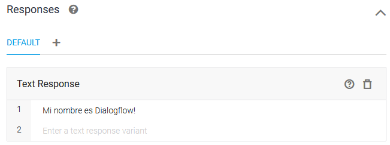

6. Haz clic en el botón **Save** (Guardar) y espera hasta que el cuadro de diálogo Entrenamiento del agente indique que se completó el entrenamiento (Agent training Complete!).

#### Prueba el intent nuevo
En el simulador, escribe `¿Cuál es tu nombre?` y presiona Intro.

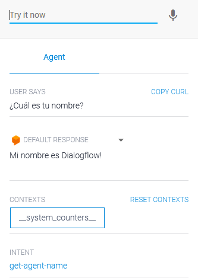

### Parámetros
Para crear un intent nuevo con parámetros, sigue estos pasos:
1. Haz clic en el botón **[+]** junto a Intents en el menú de la barra lateral izquierda.
2. Nombra el intent `set-language` en la parte superior del formulario de intents.
3. Agrega las siguientes frases de entrenamiento:

    - `Quiero cambiar el idioma a Inglés`
    - `Cambiar a Francés`
    - `Definir el idioma en Alemán`

4. Haz clic en el botón **Save** (Guardar) y espera hasta que el cuadro de diálogo **Entrenamiento del agente** indique que se completó el entrenamiento.

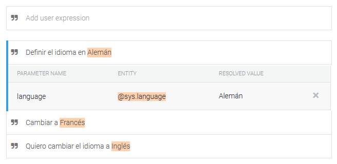

Automáticamente, Dialogflow detecta parámetros en las frases de entrenamiento que se reconocen como entidades del sistema. Para que el parámetro pueda usarse en la respuesta, es necesario asegurarse que los parámetros en la pregunta estén asignados correctamente a la misma referencia, en este caso se estaría usando `$language`.

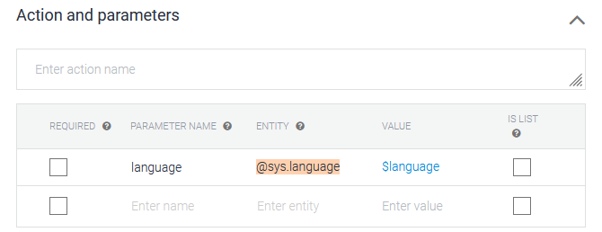

Es posible que Dialogflow detecte palabras que no queremos que se tomen como parámetros. Para modificar o remover la palabra asignada como parámetro en la frase de entrenamiento sigue estos pasos:
1. Seleccionar la frase de entrenamiento del listado que se quiere modificar
2. Hacer clic en la palabra a la cual se quiere modificar o remover la asignación de parámetro. Se desplegará un menú con el listado de parámetros disponibles.
3. Para cambiar el parámetro, selecciona el parámetro deseado del listado.
4. Haz clic en el ícono  para remover el parámetro.

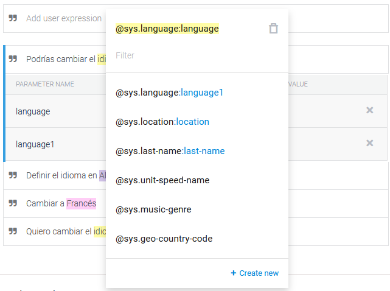

#### Usa datos de parámetros en una respuesta
Para agregar una respuesta que use un parámetro, haz lo siguiente:
1. Desplázate hacia abajo hasta la sección Respuestas.
2. Agrega la siguiente respuesta de texto: `Actualmente no se encuentra disponible el cambio de idioma a $language`.
3. Haz clic en el botón Guardar y espera hasta que el cuadro de diálogo Entrenamiento del agente indique que se completó el entrenamiento.

#### Prueba tu parámetro
En el simulador, ingresa `Cambiar el idioma a Chino`.
Puedes ver que Dialogflow extrae de forma correcta el parámetro language con el valor `Chino` y que se insertó de forma correcta en donde se usó la referencia del parámetro en la respuesta.

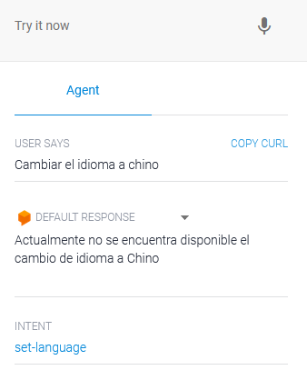

#### Crea tus propias entidades
Sigue estos pasos para crear una entidad personalizada:
1. Haz clic en el botón para agregar entidades **[+]** junto a **Entities** (Entidades) en el menú de la barra lateral izquierda.
2. Ingresa `movie-genre` para el nombre de la entidad.
3. Agrega las siguientes entradas de entidad (filas):

| Valor de referencia (Reference Value) | Sinónimos (Synonyms) |
| --- | --- |
| Terror | Terror,Horror,Miedo |
| Drama | Drama |
| Ciencia Ficción | Ciencia Ficción, Sci-Fi |
| Animada | Animada,Infantil |
| Comedia | Comedia |

4. Haz clic en el botón Guardar y espera hasta que el cuadro de diálogo Entrenamiento del agente indique que se completó el entrenamiento.

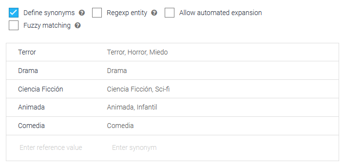

#### Usa la entidad nueva
Crea un nuevo intent y agrega las frases de entrenamiento que usan la entidad nueva mediante estos pasos:
1. Haz clic en el botón **[+]** junto a Intents en el menú de la barra lateral izquierda.
2. Nombra el intent `request-movie-list` en la parte superior del formulario de intents.
3. Agrega las siguientes frases de entrenamiento:
    - `Dame un listado de películas de Comedia`
    - `Podrías recomendarme películas Infantiles?`
    - `Quiero un listado de películas de Terror`
4. Si es necesario, asigna el parámetro `movie-genre` al género en la frase de entrenamiento.
5. En la sección Respuestas, agrega la siguiente respuesta de texto secundaria: `Lo siento, actualmente no contamos con recomendaciones para el género de películas $movie-genre`.
6. Haz clic en el botón **Save** (Guardar) y espera hasta que el cuadro de diálogo **Entrenamiento del agente** indique que se completó el entrenamiento.

#### Prueba la entidad nueva
En el simulador, ingresa `Quiero un listado de películas de Terror`.
Puedes ver que Dialogflow extrajo de forma correcta `Terror` para el parámetro `movie-genre`, lo identificó como la entidad `Terror` y, luego, insertó el valor en la respuesta.

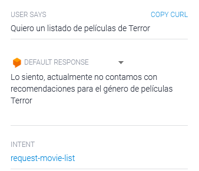

#### Parámetros requeridos
¿Qué pasa si el usuario no especifica cuál es el género de películas que quiere?
Ingresa en el simulador `Quiero un listado de películas`
Dialogflow identifica el intent pero como el parámetro no ha sido proporcionado no puede generar una respuesta adecuada, por lo que el parámetro debería se requerido siempre.
Para definir el parámetro como requerido sigue estos pasos.
1. Selecciona el intent `request-movie-list` que creaste en los pasos anteriores.
2. En la sección **Action and parameters** haz clic en el checkbox **REQUIRED** del parámetro `movie-genre`

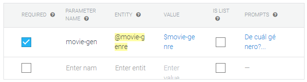

3. Haz clic en el botón **Save** (Guardar) y espera hasta que el cuadro de diálogo **Entrenamiento del agente** indique que se completó el entrenamiento.
4. En el simulador, ingresa `Quiero un listado de películas`. Dialogflow genera la respuesta por defecto `What is the movie-genre?` solicitando el parámetro.
5. Para personalizar la respuesta haz clic en **PROMPTS** y agrega el mensaje para solicitar el género `¿De cuál género?`

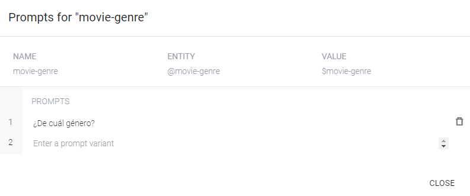

3. Haz clic en el botón **Save** (Guardar) y espera hasta que el cuadro de diálogo **Entrenamiento del agente** indique que se completó el entrenamiento.
4. En el simulador, ingresa nuevamente `Quiero un listado de películas`.

### Contextos
Para controlar el flujo de la conversación, puedes usar el contexto.

#### Agrega un intent de seguimiento
Para agregar un intent de seguimiento personalizado al intent `request-movie-list`, sigue estos pasos:
1. Selecciona el intent `request-movie-list` que creaste en los pasos anteriores.
2. En la sección Respuesta, actualiza la respuesta de texto:
    - `Por favor ingrese la cantidad de resultados deseado en el listado de recomendaciones para el género de películas $movie-genre`
3. Haz clic en el botón **Save** (Guardar) y espera hasta que el cuadro de diálogo **Entrenamiento del agente** indique que se completó el entrenamiento.
4. Haz clic en **Intents**, en el menú de la barra lateral izquierda.
5. Coloca el cursor sobre el intent `request-movie-list` y haz clic en **Add follow-up intent** (Agregar intent de seguimiento).
6. Haz clic en **Custom** (Personalizado) en la lista que aparece.

Dialogflow nombra de forma automática el intent de seguimiento como `request-movie-list - custom`.

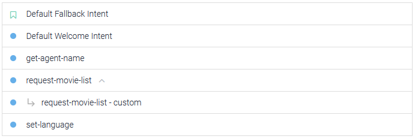

#### Coincidencia con intents de seguimiento
Los intents de seguimiento solo coinciden después de que el intent superior haya coincidido. Dado que el intent `request-movie-list - custom` solo tiene coincidencias después del intent `request-movie-list`, puedes dar por sentado que al usuario se le mostró el mensaje `Por favor ingrese la cantidad de resultados deseado en el listado de recomendaciones para el género de películas $movie-genre`. Ahora, puedes agregar frases de entrenamiento para las respuestas probables del usuario a esa pregunta:

1. Haz clic en Intents, en el menú de la barra lateral izquierda.
2. Haz clic en el intent `request-movie-list - custom`.
3. Agrega las siguientes frases de entrenamiento:
    - `3 resultados`
    - `Quiero un listado de 5 resultados`
    - `10 películas`
4. Asigna el nombre `results` al parámetro numérico y asegúrate que es correctamente asignado a los números en las respuestas.
5. Define el parámetro como **REQUIRED** y asigna el **PROMPT** como `Por favor ingresa la cantidad de resultados requerido`.
6. Haz clic en el botón **Save** (Guardar) y espera hasta que el cuadro de diálogo Entrenamiento del agente indique que se completó el entrenamiento.

#### Prueba el intent de seguimiento
Ingresa `Dame un listado de películas de Comedia` en el simulador y, luego, responde con `10 películas`.

A pesar de que no hay respuesta para la segunda expresión (`10 películas`), puedes ver que la expresión coincide con el intent correcto (`request-movie-list - custom`) y que el parámetro de duración se analiza de forma correcta (`10 películas`).

#### Intents y contextos
Inspecciona el intent `request-movie-list` para verificar que `request-movie-list-followup` aparece como un contexto de salida, precedido por el número 2. Este número es el indicador de la vida útil.

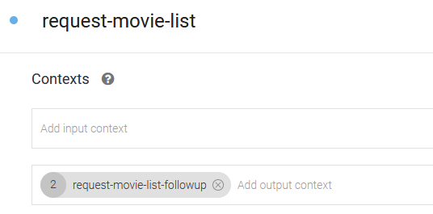

Inspecciona el intent `request-movie-list - custom` para verificar que `request-movie-list-followup` aparece como un contexto de entrada, que es igual que el contexto de salida para el intent `request-movie-list`.

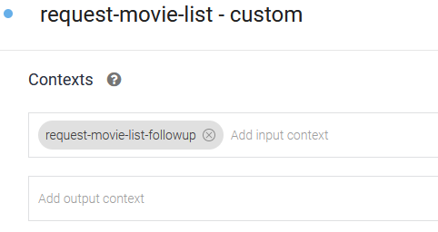

#### Contextos y parámetros
Para hacer referencia al género en la respuesta, haz lo siguiente:

1. Actualiza la respuesta de texto del intent `request-movie-list - custom` a `El listado de películas de #request-movie-list-followup.movie-genre con $results resultados se está generando en este momento. Espere por favor...`
2. Haz clic en el botón **Save** (Guardar) y espera hasta que el cuadro de diálogo Entrenamiento del agente indique que se completó el entrenamiento.

La referencia `#request-movie-list-followup.movie-genre` se conoce como [referencia de parámetro para un contexto activo](https://cloud.google.com/dialogflow/docs/intents-actions-parameters?hl=es-419#context).

#### Prueba el parámetro de contexto
Ingresa `Dame un listado de películas de Comedia` en el simulador y, luego, responde la pregunta con `7 resultados`. Ten en cuenta que el valor del parámetro language se recupera del contexto.

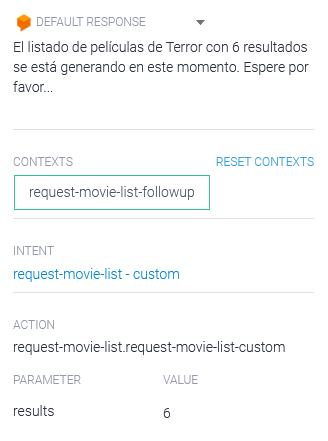

### Fulfillment

#### Habilita e implementa la entrega con el editor directo
Para habilitar e implementar el código de entrega predeterminado con el editor intercalado, haz lo siguiente:

1. Haz clic en **Fulfillment** (Entregas) en el menú de la barra lateral izquierda.
2. Establece el **Inline Editor** (Editor Directo) como **Enabled** (Habilitado).
3. Si no habilitaste la facturación en los pasos de configuración, se te solicitará que habilites la facturación ahora. Cloud Functions tiene cargos asociados, pero el servicio está disponible sin cargo hasta una cantidad significativa de invocaciones mensuales. Ten en cuenta que aún debes registrar y proporcionar una cuenta de facturación. Cancela cuando quieras.
4. Haz clic en **Deploy** (Implementar) en la parte inferior del formulario y espera hasta que los cuadros de diálogo indiquen que se implementó.

#### Prueba las entregas
Debes habilitar la entrega para cada intent que la requiera. Para habilitar la entrega en el intent de bienvenida predeterminado, haz lo siguiente:

1. Busca en el código del editor de entregas la función `welcome(agent)` y personaliza el mensaje de respuesta
```
function welcome(agent) {
  agent.add(`Hola, soy el Agente Virtual del Workshop!`);
}
```
2. Haz clic en **Deploy** (Implementar) en la parte inferior del formulario y espera hasta que los cuadros de diálogo indiquen que se implementó.
3. Haz clic en **Intents**, en el menú de la barra lateral izquierda.
4. Haz clic en el intent de bienvenida predeterminado **Default Welcome Intent**.
5. Desplázate hacia abajo hasta la sección **Fulfillment** (Entregas) y activa la opción **Enable webhook call for this intent** (Habilitar llamadas de webhook para esta intent).
6. Haz clic en el botón **Save** (Guardar) y espera hasta que el diálogo **Agent Training** indique que se completó el entrenamiento.

>***Nota: La habilitación de las entregas reemplaza las respuestas establecidas en la sección de respuestas de la intent. Sólo si fallan las entregas, se usarán las entradas de la sección Respuestas.***

#### Crea un controlador de entregas personalizado
Los pasos anteriores usan un controlador proporcionado por el código del editor intercalado predeterminado. Para crear un controlador personalizado, sigue estos pasos:

1. Habilita la entrega para el intent get-agent-name que creaste en los pasos anteriores.
2. Haz clic en Entregas en el menú de la barra lateral izquierda y examina el código en el editor intercalado.
3. Busca esta línea:
```
exports.dialogflowFirebaseFulfillment = functions.https.onRequest((request, response) => {
```
La función `onRequest` controla todas las solicitudes de Dialogflow. En el cuerpo de esta función, se definen las funciones específicas del controlador. Estas funciones del controlador se invocan cuando se detecta una coincidencia con los intents asociados.

4. Debajo de los controladores existentes, agrega esta función para la intent `get-agent-name`:
```
function getAgentNameHandler(agent) {
  agent.add('Desde entrega: Mi nombre es Miss Minutes!');
}
```
5. Debajo de las definiciones de la función del controlador, están las llamadas `intentMap.set()`. Estas llamadas asocian los controladores específicos con los intents por nombre. Por ejemplo, `intentMap.set('Default Welcome Intent', welcome)` asocia el controlador welcome con el intent denominado `Default Welcome Intent`.
6. Debajo de las llamadas existentes `intentMap.set`, agrega esta línea para el intent `get-agent-name`:
```
intentMap.set('get-agent-name', getAgentNameHandler);
```
7. Haz clic en **Deploy** (Implementar) en la parte inferior del formulario.
8. Ingresa `Cuál es tu nombre?` en el simulador. La respuesta `Desde entrega: Mi nombre es Miss Minutes!` se envía desde tu controlador nuevo.

#### Accede a los valores de los parámetros
En los pasos anteriores, has creado un intent `set-language` para identificar el idioma. El intent usa el parámetro `language`. En esta sección, accederás al valor de este parámetro en tu controlador de entregas.

Para agregar el controlador, sigue estos pasos:
1. Habilita la entrega para el intent `set-language`.
2. Haz clic en **Fulfillment** en el menú de la barra lateral izquierda.
3. Como en los pasos anteriores, agrega el siguiente controlador y la llamada intentMap:
```
function languageHandler(agent) {
    const language = agent.parameters.language;
    if (language) {
        agent.add(`Desde entrega: Actualmente no se encuentra disponible el cambio de idioma a ${language}`);
    } else {
        agent.add(`Desde entrega: ¿En qué puedo ayudarle?`);
    }
}
```
```
intentMap.set('set-language', languageHandler);
```
4. Haz clic en **Deploy** (Implementar) en la parte inferior del formulario.
5. Ingresa `Quiero cambiar el idioma a Inglés` en el simulador. La respuesta `Desde entrega: Actualmente no se encuentra disponible el cambio de idioma a Inglés` se envía desde tu controlador nuevo.

## Telegram
La integración de Telegram con Dialogflow te permite crear fácilmente bots de Telegram con la comprensión del lenguaje natural basada en la tecnología de Dialogflow.

>***Nota: Esta integración solo admite el idioma predeterminado del agente.*** |

### Configura Telegram
A fin de configurar la integración de Telegram para tu agente, necesitarás lo siguiente:
- Una [cuenta de Telegram](https://web.telegram.org/#/login)

#### Crear un Bot en Telegram
1. Accede a Telegram y ve a https://telegram.me/botfather o busca la cuenta verificada de BotFather.
2. Escribe `/start` en la conversación.
3. Haz clic en `/newbot` o escríbelo y, luego, ingresa un nombre para el bot.
4. Ingresa un nombre de usuario para el bot, que termine en "bot" (p. ej., garthsweatherbot).
****Este nombre será el identificador del bot en Telegram, por lo que debe ser único y no es posible cambiarlo, elige sabiamente!**** 
5. Copia el token de acceso que se generó:

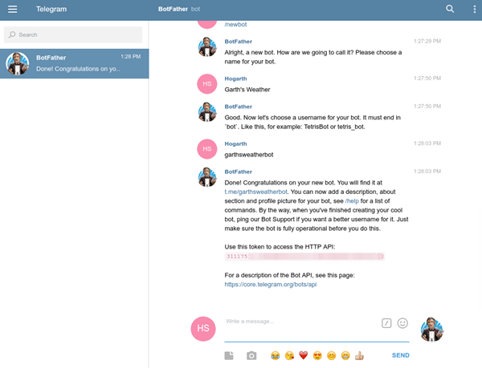

### Configura Dialogflow
1. En Dialogflow, ve a **Integrations** (Integraciones) en el menú de la izquierda.
2. Haz clic en el ícono **Telegram**.
3. Pega el Token de acceso en el campo relacionado.
4. Haz clic en el botón **Start** (Iniciar):

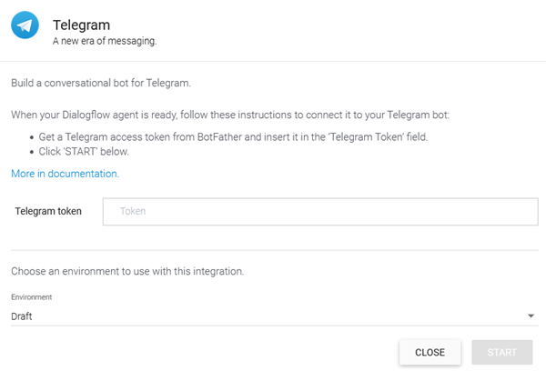

### Realiza pruebas en Telegram
BotFather proporcionará un vínculo a tu bot una vez que hayas completado la configuración. Abre este vínculo para probar tu agente:

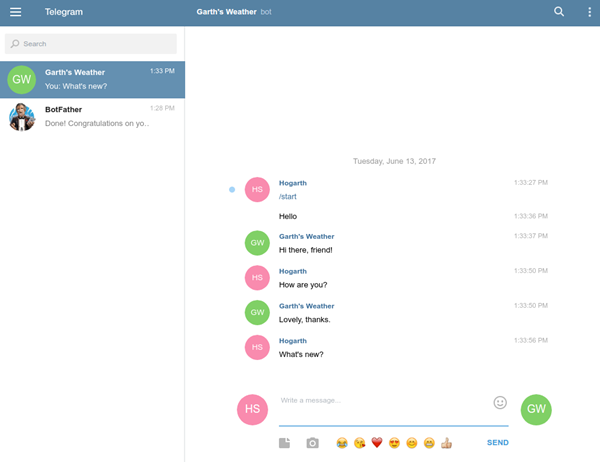

## Herramienta de Automatización de creación de Intents
Es posible automatizar la creación de intents creando los archivos JSON correspondientes para posteriormente importarlos en Dialogflow ES.
La herramienta ha sido desarrollada en Python y se puede descargar [aquí](https://github.com/davidrps/bulk-intent-generator).

En el respositorio se explica el funcionamiento de la herramienta, junto con el detalle del formato del archivo CSV que debe incluir el listado de intents a importar.

**Se recomienda elaborar un diagrama de decisión para facilitar la creación de los elementos necesarios para que el Chatbot se comporte correctamente**

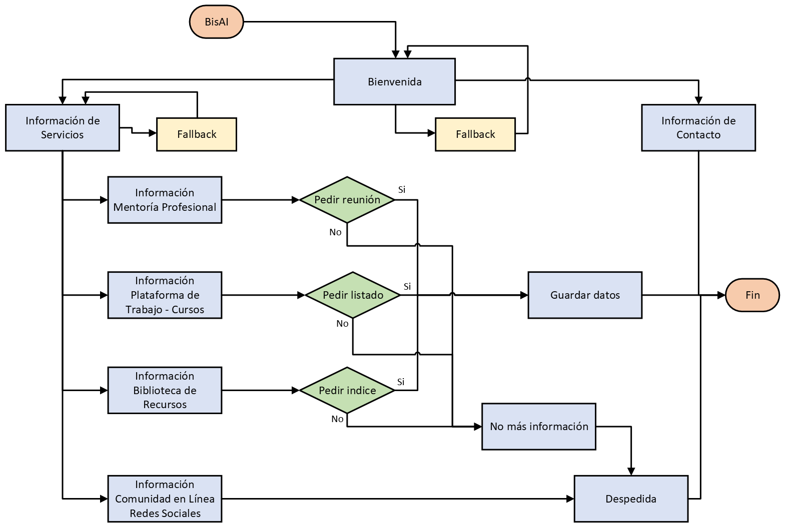